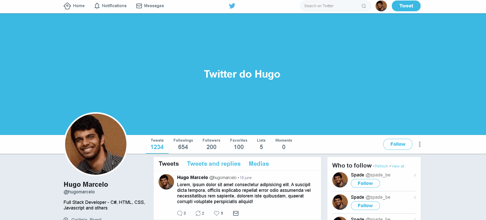

# Twitter Flexbox

Esse projeto utiliza flexbox para criar a tela inicial do Twitter na versão do ano de 2018.

# Demo

## Technologies Used
* HTML
* CSS

## License

The code in this project is licensed under the MIT License. See [LICENSE](LICENSE) for details.